# Mutual Information Maximization in Graph Neural Networks

# Overview
This repository contains the implementation of paper titled 'Mutual Information Maximization in Graph Neural Networks', which was accepted by IJCNN 2020. In the paper, we extend the graph neural networks frameworks by exploring the aggregation and iteration scheme in the methodology of mutual information. We propose a new approach of enlarging the normal neighborhood in the aggregation of graph neural networks, which aims at maximizing mutual information. The proposed approach improves the performance of the following graph models: 

* **[GCN](https://github.com/weihua916/powerful-gnns)** from Xu *et al.*: [Representation learning on graphs: Methods and applications](https://arxiv.org/abs/1709.05584) (2017)

* **[GIN](https://github.com/weihua916/powerful-gnns)** from Xu *et al.*: [Representation learning on graphs: Methods and applications](https://arxiv.org/abs/1810.00826) (ICLR-2019)

* **[LDS-GNN](https://github.com/lucfra/LDS-GNN)** from Luca *et al.*: [Learning Discrete Structures for Graph Neural Networks](https://arxiv.org/abs/1903.11960) (ICML-2019)

* **[GMNN](https://github.com/DeepGraphLearning/GMNN)** from Luca *et al.*: [Graph Markov Neural Networks](https://arxiv.org/abs/1905.06214) (ICML-2019)

* **[PWL](https://github.com/BorgwardtLab/P-WL)** from Bastian Rieck *et al.*: [A Persistent Weisfeiler–Lehman Procedure for Graph Classification](http://proceedings.mlr.press/v97/rieck19a/rieck19a.pdf) (ICML-2019)

* **[GRAPH_Unet](https://github.com/bknyaz/graph_nn)** Gao *et al.*: [Graph_Unet](https://openreview.net/pdf?id=HJePRoAct7) (ICML-2019)

* **[Graphite](https://github.com/ermongroup/graphite)** Grover *et al.*: [Graphite: Iterative Generative Modeling of Graphs](https://arxiv.org/abs/1803.10459) (ICML-2019)

* **[VGAE](https://github.com/ermongroup/graphite)** Max Welling *et al.*: [VGAE:Variational graph auto-encoders](https://arxiv.org/abs/1611.07308) (ICML-2019)

* **[MGCNK](https://github.com/bknyaz/graph_nn)** Max Welling *et al.*: [Semi-Supervised Classification with Graph Convolutional Networks](https://arxiv.org/abs/1609.02907) (ICLR-2017)

* **[CHEBNET](https://github.com/bknyaz/graph_nn)** Boris Knyazev *et al.*: [Spectral Multigraph Networks for Discovering and Fusing Relationships in Molecules](https://arxiv.org/abs/1811.09595) (NipsW-2018)

Different models are in separated folders.

# Experimental results
## Experiment No. 1:
Supervised graph classification in comparison with GCN and GIN on 7 datasets.

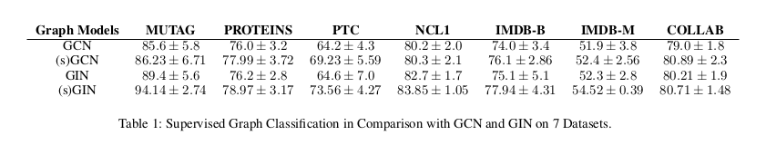

## Experiment No. 2:
Supervised graph classification in comparison with KNN-LDS on 6 datasets.

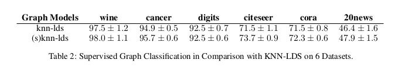

## Experiment No. 3:
Supervised graph classification in comparison with P-WL and its variants on 2 datasets.

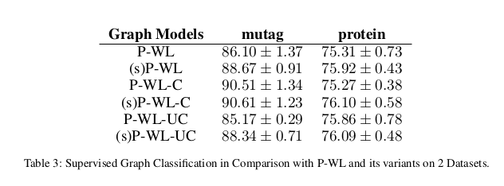

## Experiment No 4:
Semi-supervised graph classification in comparison with GMNN on 3 datasets.

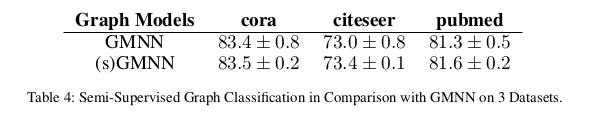

## Experiment No 5:
Graph link prediction.

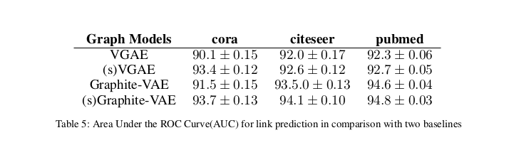

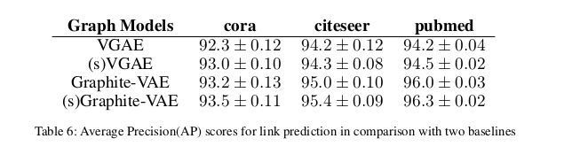

## Experiment No 6:
Edge generation and graph classification.

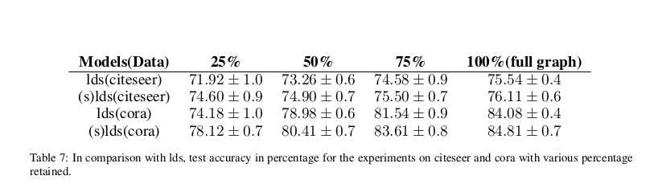

## Experiment No 7:
Graph classification with node attribute.

## Experiment No. 8:
Graph classification in comparison with GCN, MGCN and MGCNK.

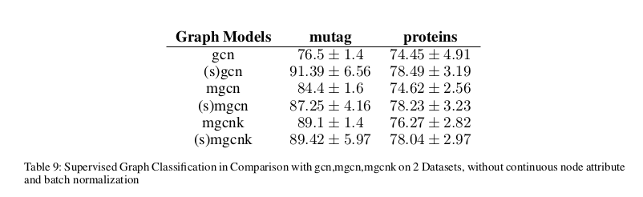

## Experiment No 9:
Supervised graph classification in comparison with two transformation forms and two baseline models.

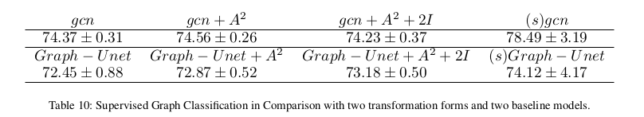

## Experiment No. 10:
Supervised graph classification for three datasets in comparison with Mixhop and (s)gmnn.

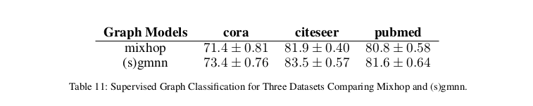

## Experiment No. 11:
Supervised graph classification in comparison with the state-of-the-art models on 13 datasets.

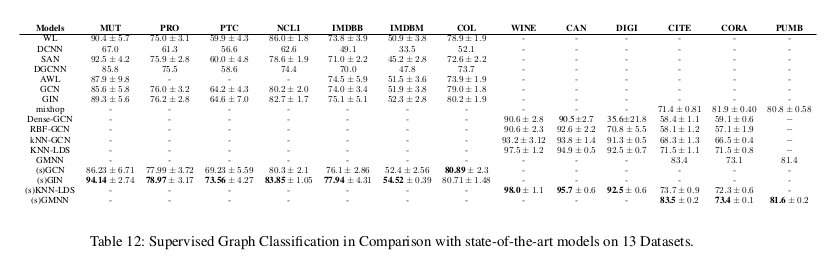

